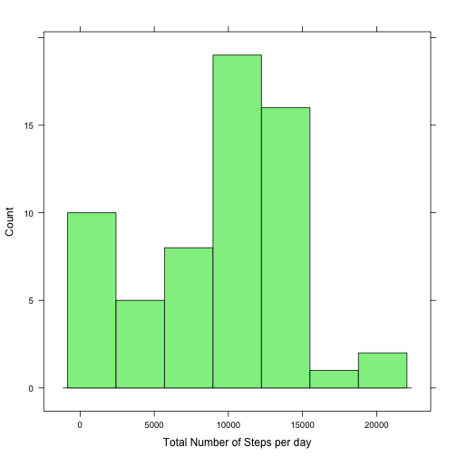
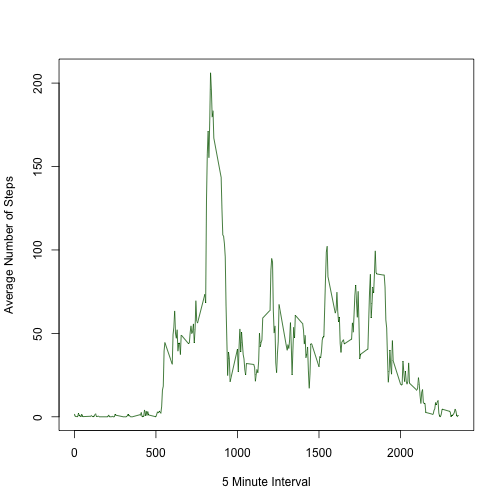
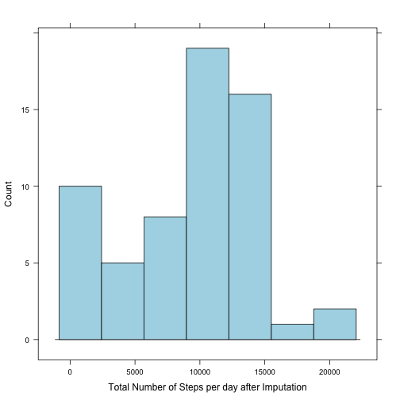
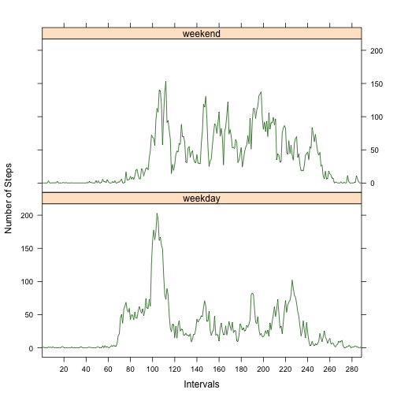

Reproducible Research: Peer Assessment 1
========================================================

## Loading and preprocessing the data

Data loaded from working directory
Data was process into a format suitable for analysis  
        - Data was downloaded from https://d396qusza40orc.cloudfront.net/repdata%2Fdata%2Factivity.zip  
        - A new column was generated with the respective date format  
        - Interval were defined as factor for analytical purposes
        

```r
setwd("~/Desktop/coursera/R_courses/reprodducibleresearch/progasig1")
act<-read.csv("activity.csv", header=T)
act$date1<-as.Date(format(act$date, format =  "%Y %m %d"))
act$interval<-as.factor(act$interval)
```
Structure of the data for the reader:  

```r
str(act)
```

```
## 'data.frame':	17568 obs. of  4 variables:
##  $ steps   : int  NA NA NA NA NA NA NA NA NA NA ...
##  $ date    : Factor w/ 61 levels "2012-10-01","2012-10-02",..: 1 1 1 1 1 1 1 1 1 1 ...
##  $ interval: Factor w/ 288 levels "0","5","10","15",..: 1 2 3 4 5 6 7 8 9 10 ...
##  $ date1   : Date, format: "2012-10-01" "2012-10-01" ...
```

## What is mean total number of steps taken per day?

### Histogram of the total number of steps taken each day  

```r
stepsperday<-as.data.frame(tapply(act$steps, act$date, sum, na.rm=T))
names(stepsperday)<-("steps")

library(lattice)
histogram(stepsperday$steps, type="count", col="light green", xlab="Total Number of Steps per day")
```

 

### Mean and median total number of steps taken per day

```r
mean(stepsperday$steps)
```

```
## [1] 9354
```

```r
median(stepsperday$steps)
```

```
## [1] 10395
```

## What is the average daily activity pattern?

### Time series plot of the 5-minute interval (x-axis) and the average number of steps taken, averaged across all days (y-axis)  

```r
meanstepsperinterval<-as.data.frame(tapply(act$steps, act$interval, mean, na.rm=T), row.names=NULL)
names(meanstepsperinterval)<-("Interval")

plot(rownames(meanstepsperinterval), meanstepsperinterval[,1] , type ="l", xlab= "5 Minute Interval", ylab="Average Number of Steps", col="dark green")
```

 
  
**Which 5-minute interval, on average across all the days in the dataset, contains the maximum number of steps?** 

Interval 835 contains the maximum nember of steps

```r
max<-max(meanstepsperinterval)
which(meanstepsperinterval$Interval == max)
```

```
## 835 
## 104
```

## Imputting missing values

### Total number of missing values in the dataset  

```r
table(is.na(act))
```

```
## 
## FALSE  TRUE 
## 67968  2304
```

```r
summary(act$steps)
```

```
##    Min. 1st Qu.  Median    Mean 3rd Qu.    Max.    NA's 
##     0.0     0.0     0.0    37.4    12.0   806.0    2304
```

### Imputation strategy

Strategy for imputation is based on calculating the mean per step per day and then replace it into the specific step that has NA. 

### New dataset that is equal to the original dataset but with the missing data filled in.

New column was created with the imputed dataset in order to compare between the dataset with NA and the one without NAs


```r
meanstepsperinterval<-as.data.frame(tapply(act$steps, act$interval, mean, na.rm=T), row.names=NULL)

### Simmulation
steps2<-vector()

for (i in 1:17568){
        if (is.na(act$steps[i]) == TRUE)
        meanstepsperinterval[act$date[i],]->steps2[i]        
        else act$steps[i]->steps2[i]
}

act$steps2<-steps2
```


### Histogram of the total number of steps taken each day and mean and median total number of steps taken per day. 


```r
steps2perday<-as.data.frame(tapply(act$steps2, act$date, sum, na.rm=T))
names(steps2perday)<-("steps2")

library(lattice)
histogram(steps2perday$steps2, type="count", col="light blue", xlab="Total Number of Steps per day after Imputation")
```

 

**Calculate and report the mean and median total number of steps taken per day**

```r
mean(steps2perday$steps2)
```

```
## [1] 9378
```

```r
median(steps2perday$steps2)
```

```
## [1] 10395
```

**Do these values differ from the estimates from the first part of the assignment? What is the impact of imputing missing data on the estimates of the total daily number of steps?**  
R/ Values do not differ. Imputation strategy slightly affected the mean but not the median.


## Are there differences in activity patterns between weekdays and weekends?

Dataset use was the one with imputed values.

### Factor variable in the dataset with two levels – “weekday” and “weekend”.  


```r
act$dayofweek<-weekdays(act$date1)
```

### Panel plot containing a time series plot (i.e. type = "l") of the 5-minute interval (x-axis) and the average number of steps taken, averaged across all weekday days or weekend days (y-axis). 


```r
weektype<-vector()
for (i in 1:17568){
        if (act$dayofweek[i] == "Saturday" ||  act$dayofweek[i] == "Sunday")
                "weekend"->weektype[i]        
        else "weekday"->weektype[i]
}

act$weektype<-as.factor(weektype)

library(doBy)
```

```
## Loading required package: survival
## Loading required package: splines
## Loading required package: MASS
```

```r
a<-summaryBy(steps2~weektype | interval, data=act, FUN=c(mean, sd))

xyplot(steps2.mean~interval | weektype, a, strip=T, type="l", layout=c(1,2),col="dark green",scales= list(x=list(at = seq (from = 0, to =1000, by=20))), xlab="Intervals", ylab="Number of Steps")
```

 


